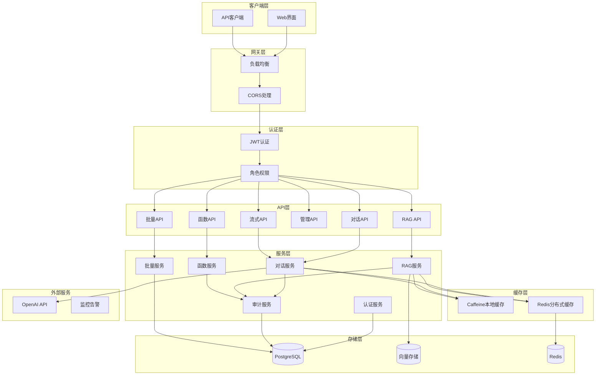
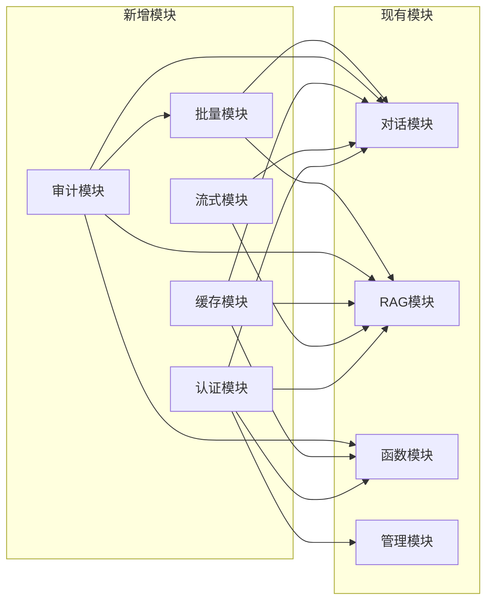
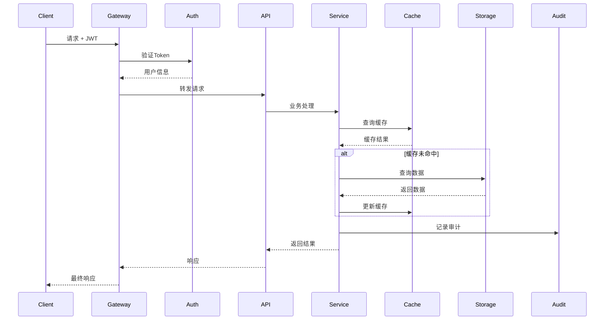

# 设计文档 - SpringAI完善

## 架构概览

### 整体架构图


## 分层设计和核心组件

### 1. 认证授权层
#### JwtAuthenticationService
- **职责**: JWT token生成、验证、刷新
- **接口**: 
  - `generateToken(User user)` 
  - `validateToken(String token)`
  - `refreshToken(String refreshToken)`

#### UserService
- **职责**: 用户管理、角色权限
- **接口**:
  - `authenticate(String username, String password)`
  - `getUserRoles(String username)`

### 2. 流式响应层
#### StreamingChatService  
- **职责**: SSE流式对话响应
- **接口**:
  - `streamChat(String prompt, SseEmitter emitter)`
  - `streamRagQuery(String query, SseEmitter emitter)`

### 3. 缓存层增强
#### DistributedCacheService
- **职责**: L1/L2缓存管理
- **接口**:
  - `get(String key, Class<T> type)`
  - `put(String key, Object value, Duration ttl)`
  - `evict(String key)`

### 4. 审计日志层
#### AuditService
- **职责**: 操作审计记录
- **接口**:
  - `logApiCall(String user, String api, Object request, Object response)`
  - `queryAuditLogs(AuditQuery query)`

### 5. 批量处理层
#### BatchProcessingService
- **职责**: 批量任务处理
- **接口**:
  - `submitBatchTask(BatchRequest request)`
  - `getBatchStatus(String taskId)`

## 模块依赖关系图


## 接口契约定义

### 1. 认证接口
```yaml
POST /api/auth/login:
  request:
    username: string
    password: string
  response:
    accessToken: string
    refreshToken: string
    expiresIn: number

POST /api/auth/refresh:
  request:
    refreshToken: string
  response:
    accessToken: string
    expiresIn: number
```

### 2. 流式接口
```yaml
GET /api/chat/stream:
  headers:
    Authorization: Bearer {token}
  params:
    prompt: string
  response:
    Content-Type: text/event-stream
    data: {content: string, done: boolean}
```

### 3. 批量接口
```yaml
POST /api/batch/documents:
  request:
    documents: [
      {title: string, content: string, metadata: object}
    ]
  response:
    taskId: string
    status: string
    
GET /api/batch/status/{taskId}:
  response:
    taskId: string
    status: string
    progress: number
    results: array
```

## 数据流向图


## 异常处理策略

### 1. 认证异常
- **401 Unauthorized**: Token无效/过期
- **403 Forbidden**: 权限不足
- **降级策略**: 匿名访问公开接口

### 2. 缓存异常
- **Redis连接失败**: 降级到本地缓存
- **缓存穿透**: 空值缓存 + 布隆过滤器
- **缓存雪崩**: 随机TTL + 熔断器

### 3. 流式响应异常
- **连接断开**: 自动重连机制
- **超时处理**: 分片传输 + 心跳检测
- **错误恢复**: 错误事件推送

### 4. 批量处理异常
- **部分失败**: 继续处理其他任务
- **资源限制**: 队列控制 + 优先级调度
- **状态恢复**: 任务状态持久化

## 性能优化设计

### 1. 缓存策略
- **L1缓存**: 热点数据，100ms TTL
- **L2缓存**: 温数据，30分钟TTL
- **缓存预热**: 启动时预加载

### 2. 连接池优化
- **HTTP连接池**: 最大200连接
- **数据库连接池**: HikariCP，10-50连接
- **Redis连接池**: Lettuce，20连接

### 3. 异步处理
- **流式响应**: 异步事件驱动
- **批量任务**: 线程池 + 队列
- **审计日志**: 异步批量写入

## 安全设计

### 1. 认证安全
- **JWT签名**: RS256算法
- **Token过期**: 访问token 1小时，刷新token 7天
- **密码存储**: BCrypt加密

### 2. API安全
- **输入验证**: JSR-303注解验证
- **输出编码**: 防止XSS
- **CSRF防护**: SameSite Cookie

### 3. 传输安全
- **HTTPS强制**: 生产环境必须
- **安全头**: HSTS, CSP等
- **敏感数据**: 不记录到日志

## 监控设计

### 1. 业务指标
- **认证成功率**: auth.success.rate
- **流式连接数**: stream.connections.active
- **缓存命中率**: cache.hit.ratio
- **批量任务状态**: batch.tasks.status

### 2. 技术指标
- **响应时间**: http.request.duration
- **错误率**: http.request.errors
- **JVM指标**: jvm.memory.used
- **Redis指标**: redis.connections.active

### 3. 告警规则
- **响应时间 > 2s**: 警告
- **错误率 > 5%**: 严重
- **缓存命中率 < 80%**: 警告
- **认证失败率 > 10%**: 严重

---

**设计完成！** 接下来进入**阶段3 - 原子化任务拆分**
