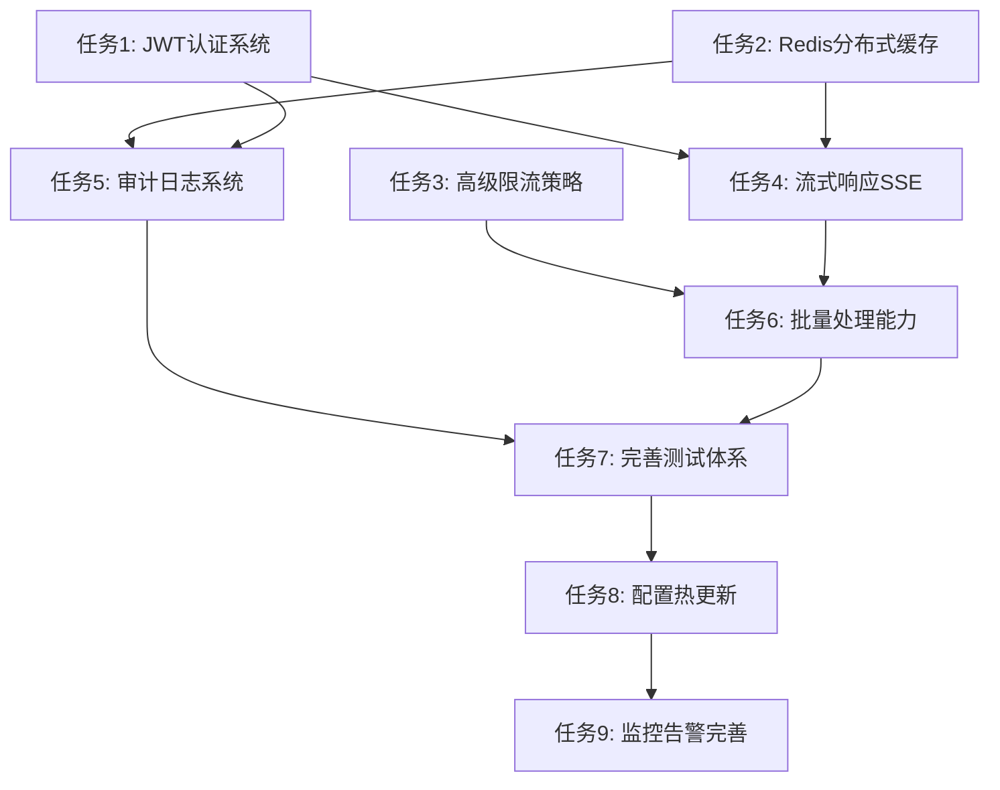

# 任务拆分文档 - SpringAI完善

## 任务依赖关系图

## 任务列表

### 任务1：JWT认证系统
#### 输入契约
- 前置依赖：现有Spring Security配置
- 输入数据：用户凭证、JWT配置参数
- 环境依赖：Spring Security, JWT库

#### 输出契约
- 输出数据：JWT token, 用户认证状态
- 交付物：
  - JwtAuthenticationService
  - JwtTokenProvider
  - UserService
  - AuthController
  - JWT配置类
- 验收标准：
  - 支持用户登录获取JWT token
  - Token验证中间件工作正常
  - Token刷新机制正常
  - 与现有API兼容

#### 实现约束
- 技术栈：Spring Security + JWT
- 接口规范：RESTful API
- 质量要求：单元测试覆盖率>80%

---

### 任务2：Redis分布式缓存
#### 输入契约
- 前置依赖：现有Caffeine缓存配置
- 输入数据：缓存配置参数、Redis连接信息
- 环境依赖：Redis服务器、Spring Data Redis

#### 输出契约
- 输出数据：分布式缓存读写能力
- 交付物：
  - DistributedCacheService
  - Redis配置类
  - 缓存降级策略
  - 缓存统计接口
- 验收标准：
  - L1(本地) + L2(Redis)缓存架构
  - Redis故障时降级到本地缓存
  - 缓存一致性保证
  - 性能提升明显

#### 实现约束
- 技术栈：Spring Data Redis + Lettuce
- 接口规范：向后兼容现有缓存接口
- 质量要求：缓存命中率>80%

---

### 任务3：高级限流策略
#### 输入契约
- 前置依赖：现有Resilience4j配置
- 输入数据：限流规则配置
- 环境依赖：Resilience4j, Redis(可选)

#### 输出契约
- 输出数据：多维度限流控制
- 交付物：
  - 用户级限流器
  - IP级限流器
  - API级限流器
  - 限流配置管理
  - 限流监控指标
- 验收标准：
  - 支持用户/IP/API三个维度限流
  - 限流规则可动态配置
  - 限流状态可查询
  - 限流指标可监控

#### 实现约束
- 技术栈：Resilience4j + AOP
- 接口规范：注解驱动
- 质量要求：限流准确性>99%

---

### 任务4：流式响应SSE
#### 输入契约
- 前置依赖：任务1(JWT认证)、现有ChatService
- 输入数据：对话请求、SSE连接
- 环境依赖：Spring WebFlux, SSE支持

#### 输出契约
- 输出数据：实时流式响应
- 交付物：
  - StreamingChatController
  - StreamingChatService
  - SSE事件处理器
  - 连接管理器
- 验收标准：
  - 支持SSE流式对话
  - 连接断开自动清理
  - 多用户并发支持
  - 错误处理完善

#### 实现约束
- 技术栈：Spring WebFlux + SSE
- 接口规范：EventSource兼容
- 质量要求：连接稳定性>95%

---

### 任务5：审计日志系统
#### 输入契约
- 前置依赖：任务1(JWT认证)、任务2(Redis缓存)
- 输入数据：API调用信息、用户操作记录
- 环境依赖：AOP、数据库存储

#### 输出契约
- 输出数据：审计日志记录和查询
- 交付物：
  - AuditService
  - AuditLogAspect
  - AuditController
  - 审计日志实体
  - 日志查询接口
- 验收标准：
  - 自动记录API调用
  - 支持日志查询和导出
  - 异步日志写入
  - 日志数据完整性

#### 实现约束
- 技术栈：Spring AOP + JPA
- 接口规范：RESTful查询API
- 质量要求：日志记录成功率>99.9%

---

### 任务6：批量处理能力
#### 输入契约
- 前置依赖：任务4(流式响应)、现有RAG服务
- 输入数据：批量任务请求
- 环境依赖：异步任务处理、队列管理

#### 输出契约
- 输出数据：批量任务处理结果
- 交付物：
  - BatchProcessingService
  - BatchController
  - 任务队列管理
  - 批量状态跟踪
  - 进度通知机制
- 验收标准：
  - 支持批量文档导入
  - 支持批量对话处理
  - 任务状态可查询
  - 支持任务取消

#### 实现约束
- 技术栈：Spring Async + 线程池
- 接口规范：异步任务API
- 质量要求：批量处理成功率>95%

---

### 任务7：完善测试体系
#### 输入契约
- 前置依赖：任务5(审计日志)、任务6(批量处理)
- 输入数据：所有业务功能代码
- 环境依赖：JUnit5, Mockito, TestContainers

#### 输出契约
- 输出数据：完整测试覆盖
- 交付物：
  - 单元测试用例
  - 集成测试用例
  - 性能测试用例
  - 测试配置文件
  - 测试文档
- 验收标准：
  - 单元测试覆盖率>85%
  - 集成测试覆盖核心流程
  - 所有测试可自动化运行
  - 测试报告生成

#### 实现约束
- 技术栈：JUnit5 + Mockito + TestContainers
- 接口规范：标准测试结构
- 质量要求：测试通过率100%

---

### 任务8：配置热更新
#### 输入契约
- 前置依赖：任务7(测试体系)
- 输入数据：配置变更请求
- 环境依赖：Spring Cloud Config(可选)

#### 输出契约
- 输出数据：运行时配置更新能力
- 交付物：
  - 配置管理Service
  - 配置更新Controller
  - 配置变更监听器
  - 配置验证机制
- 验收标准：
  - 支持运行时配置更新
  - 配置变更无需重启
  - 配置验证和回滚
  - 配置变更审计

#### 实现约束
- 技术栈：Spring Boot Actuator
- 接口规范：管理端点API
- 质量要求：配置更新成功率>99%

---

### 任务9：监控告警完善
#### 输入契约
- 前置依赖：任务8(配置热更新)
- 输入数据：监控指标、告警规则
- 环境依赖：Micrometer, 告警服务

#### 输出契约
- 输出数据：完善的监控告警体系
- 交付物：
  - 告警规则配置
  - 告警通知服务
  - 监控面板配置
  - 健康检查增强
- 验收标准：
  - 关键指标告警覆盖
  - 告警通知及时准确
  - 监控面板友好
  - 健康检查全面

#### 实现约束
- 技术栈：Micrometer + 告警服务
- 接口规范：Prometheus指标格式
- 质量要求：告警准确率>95%

## 任务执行顺序
1. **第一批并行**: 任务1(JWT认证) + 任务2(Redis缓存) + 任务3(高级限流)
2. **第二批并行**: 任务4(流式响应) + 任务5(审计日志)  
3. **第三批**: 任务6(批量处理)
4. **第四批**: 任务7(测试体系)
5. **第五批**: 任务8(配置热更新)
6. **第六批**: 任务9(监控告警)

## 风险评估
- **高风险**: 任务4(流式响应) - 技术复杂度高
- **中风险**: 任务2(Redis缓存) - 缓存一致性挑战
- **低风险**: 任务1,3,5,7,8,9 - 相对成熟的技术方案

---

**任务拆分完成！** 接下来进入**阶段4 - 审批确认**
